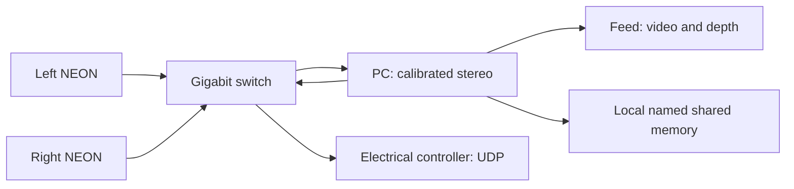

# Dual NEON setup

The PC receives two overlay-free streams, rectifies them with a measured stereo calibration, and computes metric depth using OpenCV StereoSGBM. The display contains only the left image and colour depth map. Teaching occurs in the calibration command. The same vision record is published to local shared memory and to the configured electrical controller over Ethernet UDP.



## One-time camera setup

Connect both cameras, PC and controller to the switch. Supply camera power and either router DHCP or distinct static IPv4 addresses in one subnet. An unmanaged switch does not assign addresses. Both NEONs may use the same default USB address192.168.55.1; use distinct Ethernet addresses for this rig.

The [ADLINK datasheet](https://www.adlinktech.com/Products/Download.ashx?file=1872%5CNEON-2000-JNX_series_datasheet-20230627.pdf&isDatasheet=yes&type=MDownload) specifies gigabit Ethernet and DC-jack/USB-C power. This setup assumes separate camera power, without assuming PoE support. Each exact camera's capture mode and power arrangement are **VERIFY ON HARDWARE**.

Place the cameras side by side with overlapping views. Calibration estimates their different angles and lenses; they must remain still afterward. Moving either camera, changing focus, rotation or resolution requires recalibration. A vertical arrangement or reversed left/right order is rejected by this horizontal stereo implementation.

The second camera can stay on JetPack4.x. Only capture/JPEG streaming runs there; the PC performs all depth processing. `neon_raw.py` supports Python3.6+ with existing system OpenCV, including older threaded-server/time fallbacks. Syntax and mocked compatibility checks passed; actual second-camera capture still needs verification. **Do not install PC dependencies or replace system OpenCV on the cameras.**

From **Windows cmd**, replace `LEFT_IP` and `RIGHT_IP` with the real addresses:

```bat
cd /d C:\path\to\neurogrip
setup_neon.cmd LEFT_IP
setup_neon.cmd RIGHT_IP
```

Enter SSH and sudo credentials directly in the terminal. The installer creates the dedicated `neurogrip-camera.service`, which starts the raw helper after reboot. It refuses to take over `/dev/video0` from another process: stop that specific older viewer first. It does not kill arbitrary Python processes.

Check each `http://CAMERA_IP:8081/state`: `fresh=true`, `overlays=false`, `error=null`. Capture is the first camera's verified1920x1080 V4L2 mode, set before reading, with clockwise rotation and default540-pixel output width. Normally the output is540x960; both actual stream dimensions must match. If the second sensor needs a different mode, verify that mode and adjust its helper before calibration. The existing annotated8080 viewer is not accepted for stereo calibration.

Camera-side diagnostics and removal, invoked from cmd:

```bat
ssh -t adlink@CAMERA_IP journalctl -u neurogrip-camera.service -n 40 --no-pager
ssh -t adlink@CAMERA_IP sudo systemctl disable --now neurogrip-camera.service
```

## One calibration command

Prepare a rigid checkerboard with9x6 **inner corners** (10x7 squares). Measure the actual printed square width in mm. Run:

```bat
.venv\Scripts\python.exe dual_calibrate.py
```

The script asks for both camera addresses, electrical controller `IPv4:UDP-port`, and measured square size. Enter `none` for the controller only for local testing. Addresses and settings are saved.

1. Hold the complete board still in both views. SPACE saves after0.7seconds of stability. Collect18 varied poses: image corners, tilts and working distances. Duplicate poses are rejected. Keep board orientation consistent and avoid upside-down flips.
2. Press C to solve. Poor reprojection/epipolar fit, invalid baseline, reversed order and resolution/reconnect changes are rejected. A good fit alone does not prove contact accuracy or synchronized exposure.
3. Remove the board; put the finger and target in their starting positions. SPACE freezes the rectified left image. Draw a box around the visible fingertip, then target; ENTER accepts. Include a small background margin and use matte textured surfaces. Q or `--skip-regions` gives depth-only operation with blocked object/finger output.
4. The command saves `stereo.json`, `stereo_reference.png`, board captures and `dual_config.json`, then opens the feed at `http://127.0.0.1:8090/`.

Explicit-argument example, substituting real addresses and your measured square size:

```bat
.venv\Scripts\python.exe dual_calibrate.py --left LEFT_IP --right RIGHT_IP --controller CONTROLLER_IP:55050 --square-mm 25
```

`--no-run` saves without starting the feed. `--no-browser` starts without opening a browser. Later startup with unchanged cameras/scene is:

```bat
run_dual.cmd
```

If only the taught object/reference changed, run `dual_calibrate.py --reuse-calibration`; if cameras moved, run full calibration. Lost tracking remains invalid until re-teaching. The running feed has no controls; F11 can make the browser fullscreen.

The calibration command selects a disparity search and prints approximate closest observable depth: `fx * baseline_mm / (num_disparities-1)`. It preserves at least half the image width for useful overlap. Stereo overlap, texture and occlusion further limit valid depth. Close distances outside the search are invalid, not extrapolated.

## Output and electrical handoff

The depth map uses a fixed metric colour range across time: warm is near, cool is far, black is invalid. `/depth.npz` exports metres, valid mask, rectified intrinsics and frame identity. Camera-Z depth is different from the Euclidean visible-surface fingertip/target gap; when those tracks/depths are valid the feed shows the gap in mm. `/state` and `/telemetry` exist for diagnostics but are not displayed as controls. Lost/stale pairs replace the video with a clear stale-feed message.

Give the engineer [shared-memory-bus.md](shared-memory-bus.md), [electrical-interface.md](electrical-interface.md), [../include/neurogrip_bus.h](../include/neurogrip_bus.h) and [../include/neurogrip_shm.h](../include/neurogrip_shm.h). Local shared memory uses a96-byte envelope and actual OS mutex. The Ethernet controller receives the existing48-byte binary payload via UDP; a switch does not expose the PC's shared RAM.

Direction values are BACKWARDS=0, UPRIGHT=1, FORWARDS=2, UNKNOWN=255. Unknown gap is null (binary -1), not0. Session/sequence counters, CRC and age/lifetime support rejection of replay, corruption and expired observations. The PC defaults to source UDP port55051 and sends every50ms to the configured destination. Boot session/source endpoint are printed. The reference receiver pins the peer and explicitly pairs the current boot session; a controller handshake may replace manual pairing. Session changes and silence revoke previous permission. A repeating permission heartbeat is never a strike command.

Camera calibration resets recommendations to disabled. Enabling them later requires independently measured stroke geometry, distance-error and upstream-delay bounds in the stroke config, plus explicit validated stereo timing in `dual_config.json`. This pipeline pairs **PC read-completion times**, which cannot prove simultaneous camera exposure. NEON session/read-time headers are diagnostics on separate clocks. Default `stereo_timing_validated=false` and no measured exposure-skew bound block physical permission. A board-calibration fit cannot validate those timing flags.

Feature checks latch demonstrated vertical misalignment as `camera_moved`; they cannot detect every change, especially a horizontal baseline change. Keep the cameras and finger-base calibration fixed. Mechanical interlocks, arming/current/travel feedback and a separate one-shot strike request belong to the electrical controller. No motor commands are implemented here.

## Verification and remaining hardware work

```bat
.venv\Scripts\python.exe -m unittest discover -s tests -v
.venv\Scripts\python.exe dual_camera.py --demo
.venv\Scripts\python.exe shared_memory_reader.py --name neurogrip_demo_v1
```

The demo is labelled SIMULATION and has a separate shared-memory name. Actual SGBM recovers known500/750/1500mm synthetic textured planes; display and bus publishing run end to end. This proves software geometry, not real camera accuracy, and cannot authorize a physical strike.

Only the first camera's USB viewer was available during implementation. The second camera and controller address are pending; physical capture, switch performance, calibration and controller interoperability remain **VERIFY ON HARDWARE**. The installer has not been installed remotely; SSH requires interactive login. Native C helpers need compilation in the engineer's environment.

References: [OpenCV calibration/reconstruction](https://docs.opencv.org/4.x/d9/d0c/group__calib3d.html), [StereoSGBM](https://docs.opencv.org/4.x/d2/d85/classcv_1_1StereoSGBM.html), [JetPack4.6 platform](https://developer.nvidia.com/embedded/jetpack-sdk-46).
